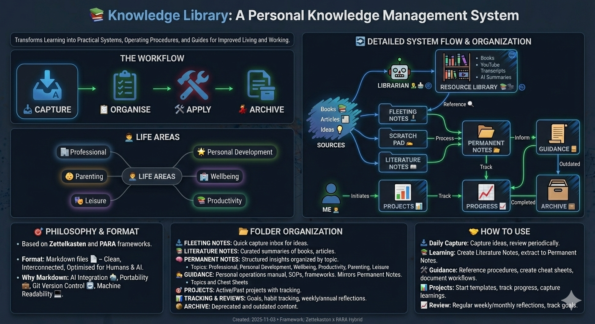

# Kenny Wilson

## 👋 About me

I am a technology leader in the investment management industry, specializing in buy-side order management systems. Currently, I'm part of the leadership team developing a firm-wide standard OMS to replace an expensive third-party vendor system, serving all investment engines across the firm. My focus is on staying at the forefront of the disruptive AI revolution to maximize the return on investment from agentic AI, building observable distributed architectures through comprehensive telemetry, and securing systems with modern OAuth flows.

## 🧭 At a glance

👨‍💻 Technology Leader - Buy-Side Order Management Systems
🌍 Based in London
🚀 Current: Part of leadership team developing firm-wide OMS to replace third-party vendor
🤖 AI Innovation - Maximizing ROI from agentic AI solutions
📊 Observable Systems - Building distributed architectures with telemetry
🔐 Security - Modern OAuth flows and secure system design
📫 Connect: [LinkedIn](https://www.linkedin.com/in/kenneth-wilson-3b14a17b/)

## 🛠️ Tech stack

  
  
  
  
  
  
  
  
  
  
  
  

---

## 🧠📚Personal Side Project: Knowledge Management System

Outside of my professional work, I pursue a personal passion for capturing, distilling, curating, and applying knowledge effectively. I explored several personal knowledge management systems (PKM), but none worked for me out of the box, so I built my own. To power this system, I created a Python package that extracts text from books and YouTube videos and catalogs them in a resource library, making them easier to retrieve and process by both humans and AI. The following infographic, created using Nano Banana Pro, shows an overview of the system.

I manage my personal knowledge via a number of specific repositories, each handling a specific aspect of my knowledge. 

* [Knowledge Library](https://github.com/kennyrnwilson/knowledge-library) holds my complete personal knowledge and life management system.
* [VS Code Workbench Icons](https://github.com/kennyrnwilson/vscode-workbench-icons) A set of icons to make my Knowledge Library look pretty in VS Code.
* [Resource Library](https://github.com/kennyrnwilson/resource-library) A private repository of books and you tube transcripts along with AI and other summaries of them.
* [Resource Librarian](https://github.com/kennyrnwilson/resource-librarian) - A set of tools developed by me to create and manage my [Resource Library](https://github.com/kennyrnwilson/resource-library)

I designed this knowledge system myself and wrote the Python code to build the resource library myself (with some help from Claude Code)
