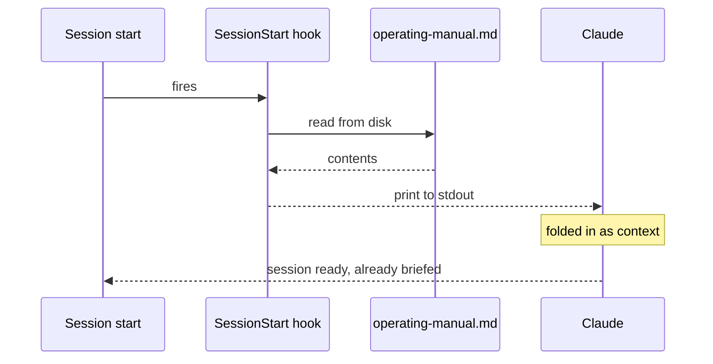

← [Back to Claude Code](./README.md)

# Shared context in every session

One short markdown document loads itself into every Claude Code session I start —
terminal, cloud, and desktop — with no copy-paste and exactly one copy of the file.

That document is the [operating
manual](https://github.com/kennyrnwilson/kennys-ai-integrations/blob/main/plugins/operating-context/operating-manual.md):
about fifty lines naming the repositories, the host, the conventions, and the two
operating systems that run through everything. Everything else hangs off it by
pointer.

## The mechanism

Claude Code supports a `SessionStart` hook, and it has one property that makes the
whole thing work: **whatever the hook prints to standard output is folded into the
session as context.**

So a hook that prints a file is a file that loads itself.



Hooks ship inside *plugins*, and plugins are published in a marketplace repository.
So the manual lives inside a small plugin called `operating-context`, alongside the
hook that prints it.

The hook is the whole of the code:

```bash
#!/usr/bin/env bash
set -euo pipefail
manual="${CLAUDE_PLUGIN_ROOT:-}/operating-manual.md"
[[ -f "$manual" ]] && cat "$manual"
exit 0
```

If the file is missing it prints nothing and exits cleanly. A convenience must never
be able to stop a session from starting.

## Why the manual sits inside the plugin

The first design had the hook **fetch** the manual from a public URL. One document on
the internet, every surface pulls it. It reads well and it is wrong.

A fetch puts a network dependency in the path of session startup — the one moment you
least want latency or a failure. It also needs an offline fallback, and a fallback is
a second copy, which is the duplication the whole exercise was meant to avoid, now
with drift.

Shipping the manual **inside** the plugin removed the network call, the failure mode,
the fallback, and the drift, all by making the design smaller.

The obvious objection — that a file inside a plugin cannot be read by other tools —
turned out to be false. The marketplace repository is public, so the file has a public
URL like any other. Browser chat fetches that same URL when asked.

## Surface coverage


| Surface | How it arrives | Status |
| --- | --- | --- |
| Claude Code CLI | plugin hook, installed once | Verified |
| Claude Code cloud | plugin installed by the environment setup script | Verified |
| Claude Desktop | shares the same plugin directory as the CLI | Verified |
| Browser chat (claude.ai) | fetches the public raw URL when asked | Works, but not automatic |
| Managed environments with a fixed plugin set | no install path | Not covered |

The last two rows are the honest boundary. Browser chat has no hook, so the manual
reaches it only when something asks for the URL. Managed environments that ship a
fixed set of plugins have nowhere to install this one, and I have not solved that.

## Installing it in the cloud

Cloud sessions cannot install a plugin interactively, but the environment's **setup
script** runs before the session starts and can do it non-interactively:

```bash
#!/usr/bin/env bash
{
  echo "=== plugin setup $(date) ==="
  command -v claude || echo "!! claude NOT on PATH"
  timeout 90 claude plugin marketplace add <owner>/<marketplace-repo> \
    || echo "!! marketplace add failed rc=$?"
  timeout 90 claude plugin install operating-context@<marketplace-repo> \
    || echo "!! install failed rc=$?"
} >"$HOME/plugin-setup.log" 2>&1
exit 0
```

Three properties, each of which earns its place:

- **A timeout on every command.** The setup script runs *before* the session and the
  session waits for it. Without a limit, the worst case is not "the plugin is
  missing" — it is "the session never opens". This is the single most important line
  here, and it was learned by breaking it.
- **`exit 0` unconditionally.** A nicety must not be able to break startup.
- **A log file.** There is no build console to read, so the script writes its own
  record. Then you open a session and ask it to read the log. The session becomes the
  log viewer.

## What this does not do

- It does not reach browser chat automatically. Nothing available does.
- It does not carry machine-specific facts. The manual is standing context, and a
  cloud container shares none of my local hardware.
- It does not hold anything private. The marketplace repository is public, so the
  manual is written to be read by anyone: no secrets, no tokens, no private paths, no
  machine endpoints.

## Further reading

- [How to Load Your Own Context Into Every Claude Code
  Session](../../articles/how-to-load-context-into-every-claude-code-session.md) —
  build it yourself, step by step.
- [Giving Claude a Memory](../../articles/giving-claude-a-memory.md) — the same
  project as a debugging story, with the three wrong diagnoses left in.
