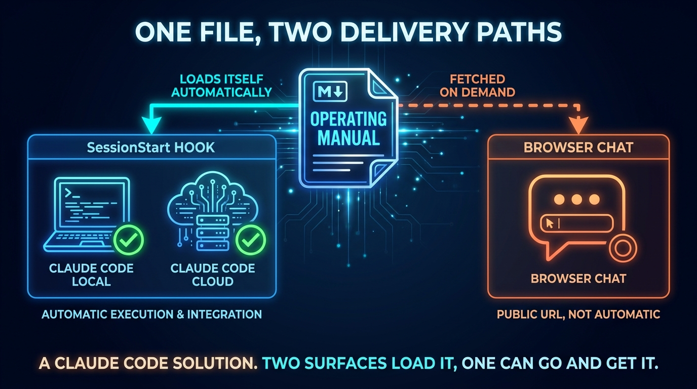
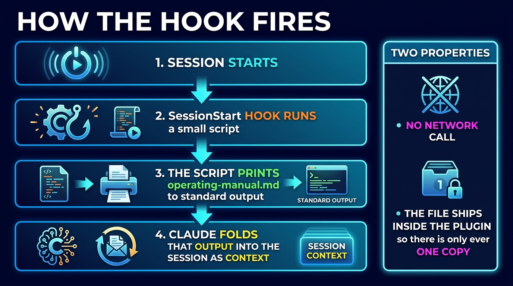
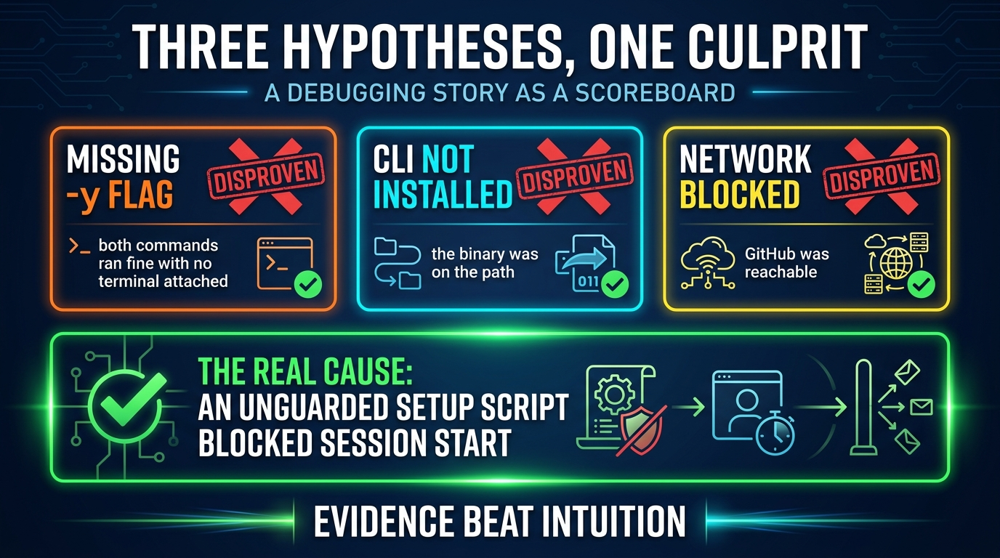

← [Back to articles](./README.md)

# Giving Claude a Memory

*How I got one markdown file to load itself into every Claude Code session I
start — local and in the cloud — and what broke along the way.*



---

## The problem: every session starts at zero

I run my life out of six git repositories. Notes, book libraries, a wellbeing
app, a swim app, a budget, and the portal that ties them together. It works well
for me — and it means that every time I open a new AI session, I spend the first
few minutes explaining the same things.

Where the docs live. Which repo owns what. That `main` on GitHub is the source of
truth. That two "operating systems" run through everything I do.

Ten sessions a day, the same preamble each time. The obvious fix is to write it
down once. The non-obvious part is *delivery*: how does that file reach the
model without me pasting it?

So I set a deliberately awkward goal:

> One short document. Loaded automatically into **every** Claude Code session —
> local terminal and cloud alike — with no copy-paste, and exactly one copy of
> the file.

A caveat worth stating up front, because it bounds everything that follows: this
is a **Claude Code** solution. The mechanism it rests on is a Claude Code hook,
so it reaches Claude Code sessions wherever they run — and it does *not*
automatically reach a browser chat, which can only go and fetch the file's public
URL when asked.

That last clause is the one that hurts. Anyone can solve this with duplication.

---

## The shape of the answer

Claude Code supports a `SessionStart` hook, and it has one property that makes
this whole idea work: **whatever the hook prints to standard output is folded
into the session as context.**

That is the entire mechanism. A hook that prints a file is a file that loads
itself.

Hooks can be packaged in a *plugin*, and plugins can be published in a
marketplace repo. So the design became: a small plugin called
`operating-context`, containing the manual and a hook that prints it.



### The decision that mattered

My first instinct was to have the hook **fetch** the manual from a public URL.
One document on the internet, every surface pulls it. Tidy.

It's also wrong, and it took a conversation to see why. A fetch introduces a
network dependency into *session startup* — the one moment you least want
latency or a failure mode. And it needs an offline fallback, which is a second
copy, which is the duplication I was trying to avoid, now with drift.

The better answer was smaller: **ship the manual inside the plugin.** The hook
reads a file sitting next to it on disk. No network call, no fallback, no
latency, nothing to go stale.

That raised an obvious objection, which I got wrong in the moment: *if the manual
lives inside a plugin, other tools can't read it.* Not true — the marketplace
repo is public, so the file has a public URL like any other. Moving it into the
plugin cost nothing. My profile README now links out to it, and browser-based
chat can fetch that same URL.

One file. Reachable by everything. No copies.

```bash
#!/usr/bin/env bash
set -euo pipefail
manual="${CLAUDE_PLUGIN_ROOT:-}/operating-manual.md"
[[ -f "$manual" ]] && cat "$manual"
exit 0
```

That's the whole hook. If the file is missing it prints nothing and exits
cleanly — a session should never fail to start because of a nicety like this.

---

## Then the cloud said no

Terminal: worked immediately. I enabled the plugin, started a fresh session,
asked a question only the manual could answer, and got it back. Done.

Then I went looking beyond the terminal. I opened a session in a managed
environment on my phone, asked what plugins were installed, and got one plugin
back. Not mine.

This is the part of the project worth writing about, because I spent the next
stretch being confidently wrong in three different directions.



### Wrong turn 1: "you can commit it to the repo"

My first fix was to commit the plugin configuration into all six repositories.
If the repo declares the marketplace and enables the plugin, surely a session
opened against that repo picks it up.

It does not. And the reason is a good one: a plugin can ship a hook that runs
**arbitrary commands**. If merely cloning a repository could auto-install a
plugin from its committed config, every repo you clone would be a code-execution
vector. So a plugin declared only by a project's settings, and sourced
externally, does not install until a human installs it.

The config I pushed was harmless. It was also inert.

### Wrong turn 2: "so it's impossible in the cloud"

I over-corrected. Interactive plugin management genuinely isn't available in
cloud sessions, so I concluded the whole approach was dead there and started
designing a fallback — inlining the manual into per-repo instruction files, the
duplication I'd spent the day avoiding.

That conclusion conflated two different things. **Installing** a plugin
interactively isn't possible in a cloud session. But plugin *components* —
skills, hooks, agents — run there perfectly well **once the plugin is
installed**. The blocker wasn't the hook. It was the installer.

And installation has a non-interactive path: the environment's setup script.

```bash
claude plugin marketplace add <owner>/<marketplace-repo>
claude plugin install operating-context@<marketplace-repo>
```

### Wrong turn 3: the confident hypothesis

I put those two lines in the setup script. The session then refused to open at
all — two minutes of nothing.

I had an immediate, plausible diagnosis: no terminal is attached to a setup
script, so the install must be waiting for a confirmation nobody can give. There
was even a documented flag for exactly that, described as *required when stdin or
stdout is not a TTY*. Textbook.

We added the flag. Still hung.

At which point I did what I should have done first: **reproduce it.** I ran both
commands locally against a throwaway home directory, with stdin redirected from
`/dev/null` so nothing could possibly prompt, and a hard timeout so a hang would
be visible rather than silent.

Both commands completed in seconds. Exit code zero. No prompt, with or without
the flag.

My hypothesis was dead — but the output contained the real clue:

```
Refreshing marketplace cache (timeout: 120s)…
Cloning repository (timeout: 120s): …
```

Two minutes. The same two minutes the session spent refusing to open.

The setup script runs **before** the session starts, and the session waits for
it. Anything slow or stuck in that script doesn't degrade startup — it *is*
startup. The failure was never about prompts or flags. It was about a script
with no time limit sitting in the critical path.

### The fix

Make the setup script structurally incapable of blocking, and make it explain
itself:

```bash
#!/usr/bin/env bash
{
  echo "=== plugin setup $(date) ==="
  command -v claude || echo "!! claude NOT on PATH"
  timeout 90 claude plugin marketplace add <owner>/<marketplace-repo> \
    || echo "!! marketplace add failed rc=$?"
  timeout 90 claude plugin install operating-context@<marketplace-repo> -y \
    || echo "!! install failed rc=$?"
} >"$HOME/plugin-setup.log" 2>&1
exit 0
```

Three properties, and each one earns its place:

- **`timeout` on every command** — the worst case becomes "the plugin is
  missing", never "the session won't open".
- **`exit 0`** — a convenience feature must never be able to break startup.
- **A log file** — I had no access to the build console, so the script writes
  its own record. Then you open a session and simply ask it to read the log.
  The session becomes the log viewer.

That last trick solved the observability problem in one move. The log came back
clean: binary found, GitHub reachable, marketplace added, **plugin installed.**

Fresh cloud session. Asked the question. It answered from the manual.

One honest boundary on that result. The environment where I first noticed the
problem — a managed, phone-friendly one with its own fixed plugin set — is *not*
the environment I ended up verifying. What I proved works is a Claude Code cloud
session. The managed environment remains uncovered, and I'd rather leave that
stated than let a tidy ending imply otherwise.

---

## What I'd tell you

**Put the data next to the code that reads it.** The fetch design was more
elegant on a whiteboard and worse in every real way. Shipping the file inside the
plugin removed a network call, a failure mode, a fallback copy, and a drift
problem — all by making the design smaller.

**Trust boundaries explain most "why won't this just work" moments.** The reason
repo-committed config can't auto-install a plugin isn't an oversight; it's the
thing standing between you and every repo you clone running arbitrary code. Once
you see the boundary, you stop fighting it and start looking for the path that's
actually sanctioned.

**A plausible hypothesis is not evidence.** Mine was excellent: documented flag,
documented condition, matching symptom. It was also wrong, and it cost a cycle
because it was *checked against the docs instead of against reality*. Ten minutes
reproducing it in a sandbox killed it — and handed over the real clue in the same
output.

**Anything in the startup path needs a time limit.** Setup scripts, hooks,
init containers. Code that runs before the thing you actually want doesn't fail
politely in the background; it fails as the thing never starting.

**When you can't see the logs, make the system tell you.** No console access
turned from a blocker into a two-line redirect. Ask the environment to write
down what happened, then ask it to read that back.

---

## Where it landed

One markdown file, in one place, that loads itself into every Claude Code session
I start, local or cloud. When I open a session now, it already knows how my
system is put together.

It is not a universal answer, and I'd rather say so than imply otherwise: it
solves the surface I actually work on all day, and leaves browser chat with a URL
it can fetch when it needs to.

The plugin is about forty lines of shell and JSON. Most of the work was deciding
where the file should live, and then finding out — three wrong turns later — what
the platform would actually let me do.

---

*Built and written with Claude Code, in one session. The debugging arc is
reported as it happened, wrong turns included.*
