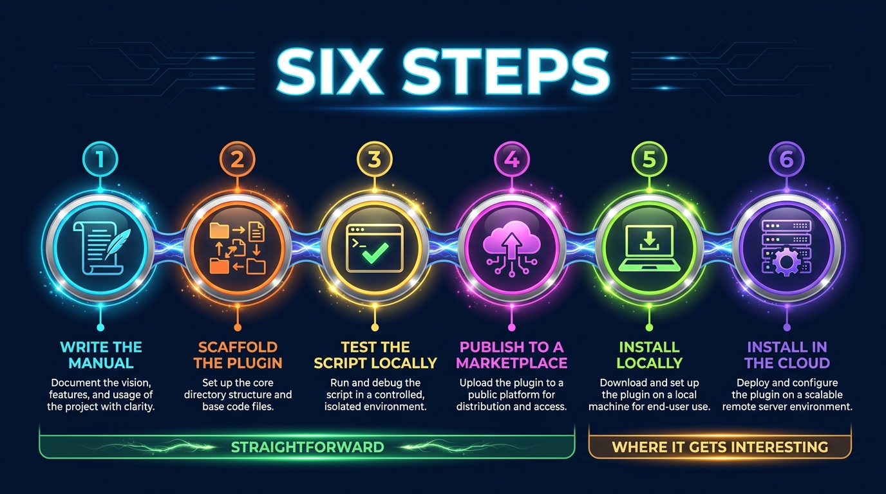
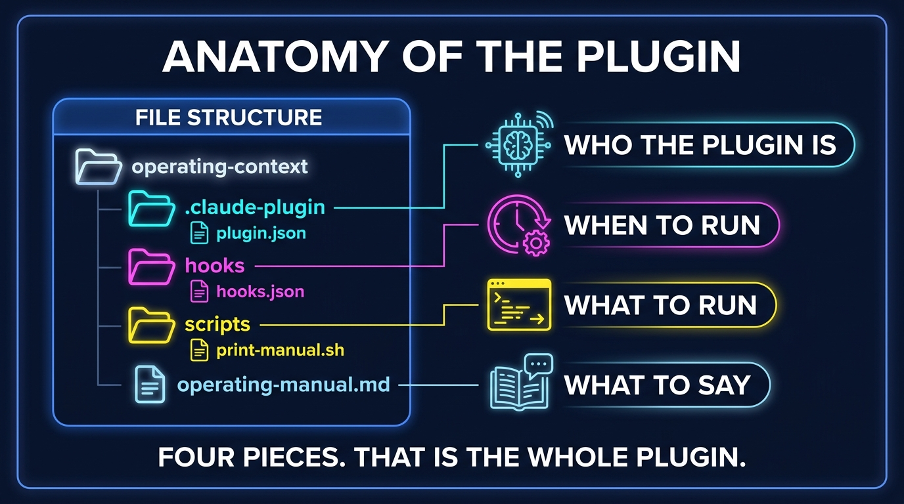
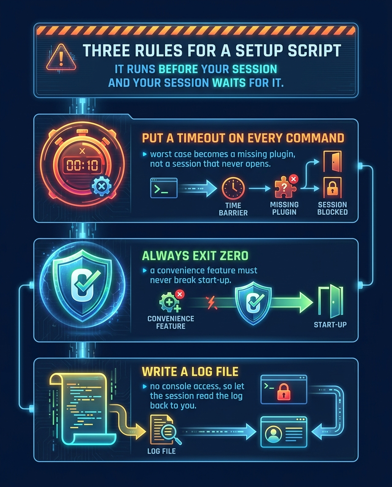

← [Back to articles](./README.md)

# How to Load Your Own Context Into Every Claude Code Session

*A step-by-step guide to building a small plugin that prints a document you
choose into every Claude Code session — local and cloud — automatically.*

---

## What you'll build

A Claude Code plugin containing two things: a markdown file you write, and a
`SessionStart` hook that prints it. Because Claude Code folds a `SessionStart`
hook's standard output into the session as context, **a hook that prints a file
is a file that loads itself.**

When you're done, every session you open already knows whatever you put in that
file — no pasting, no attaching, no reminding.


**Scope, up front.** This is a *Claude Code* technique. It covers Claude Code
sessions wherever they run, local or cloud. It does not automatically reach a
browser chat, and managed environments that ship a fixed plugin set are out of
reach too. Know that before you invest in it.

**Time:** about thirty minutes, most of it writing the document.

---

## Before you start

You'll need:

- **Claude Code** installed, and a terminal (some steps can't be done from a
  cloud session).
- **A GitHub repository to act as a plugin marketplace.** It can be a brand new,
  empty repo. Public is simplest; that also means anything you put in it is
  world-readable, which matters in Step 1.
- **Basic git**. No build step, no dependencies, no language runtime — the whole
  plugin is shell and JSON.

---

## The six steps



---

## Step 1 — Write the document

Write the thing you're tired of re-explaining. Mine describes how my repositories
fit together; yours might be architecture, conventions, or house style.

Three rules make the difference between a document that helps and one that just
burns context:

**Keep it short — aim for fifty lines.** This is an index, not a manual. It's
prepended to *every* session, so every line is a line you pay for forever.

**Include a fact only if its absence would make a session re-explain something.**
That's the whole filter. Structure and pointers in; detail out, behind links.

**Assume it is public.** If your marketplace repo is public, this file is
world-readable. No secrets, no tokens, no private file paths, no internal
hostnames or ports. Before committing, prove it rather than trust it:

```bash
grep -nEi 'token|secret|password|/Users/|127\.0\.0\.1|localhost|:8443' operating-manual.md
```

Expect no output. Any hit is a leak — remove it and run it again.

---

## Step 2 — Scaffold the plugin

Four pieces, none of them long.



In your marketplace repo, create `plugins/operating-context/`:

```
plugins/operating-context/
├── .claude-plugin/plugin.json     # who the plugin is
├── hooks/hooks.json               # when to run
├── scripts/print-manual.sh        # what to run
└── operating-manual.md            # what to say
```

**`.claude-plugin/plugin.json`** — the manifest. `name` *must* match the
directory name:

```json
{
  "name": "operating-context",
  "version": "1.0.0",
  "description": "Load my operating manual into every Claude Code session as standing context",
  "author": { "name": "your-github-username" },
  "license": "MIT"
}
```

**`hooks/hooks.json`** — registers the hook. `${CLAUDE_PLUGIN_ROOT}` resolves to
wherever the plugin gets installed, which is what makes this work on a machine
that isn't yours:

```json
{
  "description": "Load the operating manual into every session as standing context.",
  "hooks": {
    "SessionStart": [
      {
        "hooks": [
          {
            "type": "command",
            "command": "${CLAUDE_PLUGIN_ROOT}/scripts/print-manual.sh"
          }
        ]
      }
    ]
  }
}
```

**`scripts/print-manual.sh`** — the entire mechanism:

```bash
#!/usr/bin/env bash
# SessionStart stdout becomes session context. No network; if the file is
# missing, print nothing and exit cleanly so a session is never blocked.
set -euo pipefail

manual="${CLAUDE_PLUGIN_ROOT:-}/operating-manual.md"
if [[ -f "$manual" ]]; then
  cat "$manual"
fi
exit 0
```

Make it executable — forget this and the hook fails silently:

```bash
chmod +x plugins/operating-context/scripts/print-manual.sh
```

Then put your document from Step 1 at `plugins/operating-context/operating-manual.md`.

> **Why the file ships inside the plugin.** The tempting alternative is to fetch
> it from a URL so there's "one copy on the internet". Don't. A fetch puts a
> network call in the path of *session startup*, and needs an offline fallback —
> which is a second copy that drifts. Bundling the file removes the network call,
> the fallback, and the drift at once. If your repo is public, the file still has
> a public URL for anything else that wants it.

---

## Step 3 — Test the script before publishing anything

Two cases, both of which matter. Run them from the plugin directory:

```bash
# Case 1: the manual is present — should print it, exit 0
CLAUDE_PLUGIN_ROOT="$PWD" ./scripts/print-manual.sh | head -1; echo "exit=$?"

# Case 2: the manual is missing — should print nothing, still exit 0
CLAUDE_PLUGIN_ROOT="/tmp/nonexistent" ./scripts/print-manual.sh; echo "exit=$?"
```

Case 2 is the one people skip. A hook that errors when its file is missing is a
hook that can interfere with starting a session — for a convenience feature, that
trade is never worth it.

---

## Step 4 — Publish it to your marketplace

Add a `.claude-plugin/marketplace.json` at the **repo root** (create it if this
is your first plugin):

```json
{
  "name": "my-plugins",
  "owner": { "name": "your-github-username" },
  "plugins": [
    {
      "name": "operating-context",
      "source": "./plugins/operating-context",
      "description": "Load my operating manual into every session as standing context"
    }
  ]
}
```

Commit and push. The plugin is now installable by anything that can reach the
repo.

---

## Step 5 — Install it locally

In a **terminal** session:

```
/plugin
```

If your marketplace isn't listed, add it first (**Manage marketplaces → Add**,
then `your-username/your-marketplace-repo`). Then install `operating-context`
from it.

**Then start a brand-new session.** The hook fires at session start, so it can't
retroactively apply to the session you installed from.

Verify by asking something only your document could answer:

> *"What does my operating manual say about how my repositories fit together?"*

If it answers without being pointed at any file, the hook fired.

---

## Step 6 — Install it in a cloud session

This is where it gets interesting, because the interactive `/plugin` command
isn't available in cloud sessions.

That does **not** mean plugins don't work there. Plugin components — hooks
included — run in cloud sessions perfectly well. It's only the interactive
*installer* that's missing, and installation has a non-interactive path: your
cloud environment's **setup script**.

The naive version is two lines:

```bash
claude plugin marketplace add your-username/your-marketplace-repo
claude plugin install operating-context@your-marketplace-repo
```

Put exactly that in a setup script and you may find your session never opens at
all. Which brings us to the part worth internalising:



**The setup script runs before the session starts, and the session waits for it.**
Anything slow or stuck in there doesn't degrade start-up — it *is* start-up. An
unguarded command that hangs for two minutes is a session that appears broken for
two minutes.

So write it defensively:

```bash
#!/usr/bin/env bash
{
  echo "=== plugin setup $(date) ==="
  command -v claude || echo "!! claude NOT on PATH"
  timeout 90 claude plugin marketplace add your-username/your-marketplace-repo \
    || echo "!! marketplace add failed rc=$?"
  timeout 90 claude plugin install operating-context@your-marketplace-repo -y \
    || echo "!! install failed rc=$?"
  echo "=== done ==="
} >"$HOME/plugin-setup.log" 2>&1
exit 0
```

Every line of that earns its place:

- **`timeout` on every command** — the worst case becomes "the plugin is
  missing", never "the session won't open".
- **`exit 0`** — a convenience feature must never be able to break start-up.
- **`-y` on install** — required when no terminal is attached, for plugins whose
  installation runs a marketplace-declared command.
- **Redirect to a log** — you probably can't see the build console, so have the
  script write its own record.

Then read that log the easy way: open a session and ask it to.

> *"Show me the contents of ~/plugin-setup.log"*

The session becomes your log viewer. A clean run names each stage: binary found,
marketplace added, plugin installed.

Finally, open a **fresh** cloud session and ask your verification question again.

---

## Troubleshooting

| Symptom | Likely cause | Fix |
| --- | --- | --- |
| Session never opens; long hang | Unguarded setup script blocking start-up | Add `timeout` to every command and `exit 0` at the end |
| Hook does nothing, no error | Script not executable | `chmod +x scripts/print-manual.sh` |
| Nothing loads in the session you just installed from | Hook fires at session *start* | Open a new session |
| Works locally, absent in cloud | Plugin never installed in that environment | Install via the setup script (Step 6) |
| Committed the config to a repo, still not installed | Repo-declared plugins don't auto-install | Install via `/plugin` or a setup script |
| Manual is stale | Editing an installed copy, not the source | Edit in the marketplace repo, push, update the plugin |

### One trap worth naming

It's natural to think you can commit the plugin configuration into a project
repository and have sessions pick it up. You can't — and the reason is a good
one. A plugin can ship a hook that runs arbitrary commands, so if cloning a repo
could auto-install plugins from its committed config, every repo you clone would
be a code-execution vector. A plugin declared only by a project's settings, and
sourced externally, waits for a human to install it.

That's a trust boundary, not a bug. Install through `/plugin` or a setup script.

---

## What this doesn't do

- **It doesn't reach browser chat.** Chat can fetch your file's public URL when
  asked, but nothing loads it automatically.
- **It doesn't reach managed environments with a fixed plugin set.** If you can't
  run a setup script there, you can't install into it.
- **It isn't machine-aware.** The hook prints the same text everywhere, so keep
  the content portable — a cloud VM has none of your local hardware, and any
  "you are on host X" claim will simply be wrong there.

---

## Why it's worth the thirty minutes

The plugin is about forty lines of shell and JSON. What it buys is the
disappearance of a small daily tax: the two minutes at the start of every session
spent re-establishing what your setup is.

Write it once, and every session starts already knowing.

---

*Companion piece: [Giving Claude a Memory](./giving-claude-a-memory.md) — the
same project told as a debugging story, including the three wrong diagnoses this
guide lets you skip.*
